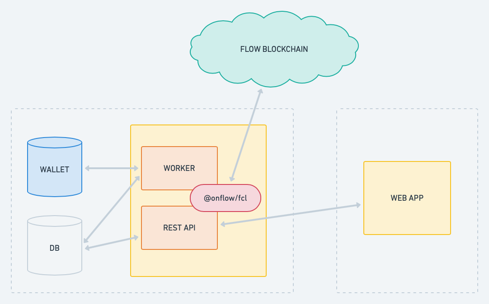

# flow-24karat-contract

Smart Contract for 24karat collection on FLOW

## Run tests

in `lib/js` run tests using this command:

```shell
npm i //frist time we need install modules
npm test	//this will run jtest for our tests
```

## Manual tests

```
flow project deploy --network=emulator
//Token
flow transactions send ./transactions/karat/setup_account.cdc
flow transactions send ./transactions/karat/mint_tokens.cdc --arg Address:0xf8d6e0586b0a20c7 --arg UFix64:"10.0"
flow scripts execute ./scripts/karat/get_balance.cdc --arg Address:0xf8d6e0586b0a20c7
//NFT collection
flow transactions send ./transactions/karatNFT/setup_account.cdc
flow transactions send ./transactions/karatNFT/mint_nft.cdc --arg Address:0xf8d6e0586b0a20c7
flow transactions send ./transactions/karatNFT/mint_nft.cdc --arg Address:0xf8d6e0586b0a20c7
flow scripts execute ./scripts/karatNFT/get_collection_length.cdc --arg Address:0xf8d6e0586b0a20c7
flow scripts execute ./scripts/karatNFT/get_nft_supply.cdc
flow scripts execute ./scripts/karatNFT/get_collection_ids.cdc --arg Address:0xf8d6e0586b0a20c7
flow scripts execute ./scripts/karatNFT/read_nft_metadata.cdc --arg Address:0xf8d6e0586b0a20c7 --arg UInt64:0
//Market
flow transactions send ./transactions/karatNFTMarket/setup_account.cdc
flow transactions send ./transactions/karatNFTMarket/create_sale_offer.cdc --arg UInt64:0 --arg UFix64:"10.0"
flow transactions send ./transactions/karatNFTMarket/create_sale_offer.cdc --arg UInt64:1 --arg UFix64:"20.0"
flow scripts execute ./scripts/karatNFTMarket/get_collection_ids.cdc --arg Address:0xf8d6e0586b0a20c7
flow scripts execute ./scripts/karatNFTMarket/get_collection_length.cdc --arg Address:0xf8d6e0586b0a20c7 --arg Address:0xf8d6e0586b0a20c7
flow transactions send ./transactions/karatNFTMarket/remove_sale_offer.cdc --arg UInt64:0
flow scripts execute ./scripts/karatNFTMarket/get_collection_ids.cdc --arg Address:0xf8d6e0586b0a20c7
flow transactions send ./transactions/karatNFTMarket/buy_market_item.cdc --arg UInt64:1 --arg Address:0xf8d6e0586b0a20c7 --arg Address:0xf8d6e0586b0a20c7 --arg UFix64:"0.05"
```

## Testnet Demo

Check out the [live demo of 24Karat collection](http://24karat-develop.netlify.app),
deployed on the Flow Testnet.

## Project Overview



## 🔎 Legend

Above is a basic diagram shows this project contains a static web app, a backend REST API in a web server, and how each part interacts with the others.

### Contracts code

This repository is only for the open-sourced smart contracts. It also contains test cases so we can run automated tests.

### Wallet

The wallet is hosted in the backend server. We will take responsibility to keep our client's wallets carefully and safely for this stage. which means we will cover all blockchain-related fees for our clients.

## 💎 What are [24Karat](https://www.24karat.io) collection?

24Karat collection is an Arts NFT ( [non-fungible tokens](https://github.com/onflow/flow-nft) ) marketplace, which is stored on the Flow blockchain.

The NFT Arts can be purchased from the marketplace with fungible tokens.

---

👹 Happy Hacking!
